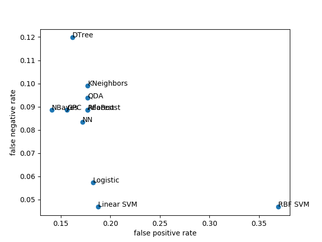

# Pima Indians Diabetes Database

J. W. Smith, J. E. Everhart, W. C. Dickson, W. C. Knowler and
R. S. Johannes, "Using the ADAP learning algorithm to forecast the
onset of diabetes mellitus",
Proc. Annu. Symp. Comput. Appl. Med. Care, pp. 261-265, Nov. 1988.

- https://www.kaggle.com/uciml/pima-indians-diabetes-database
- https://www.openml.org/d/37
- https://datahub.io/machine-learning/diabetes
- https://www.cs.waikato.ac.nz/ml/weka/arff.html

# Install

<pre>
python -m pip install arff sklearn matplotlib
</pre>

# Data

<pre>
1. Number of times pregnant
2. Plasma Glucose Concentration at 2 Hours in an Oral
Glucose Tolerance Test (GTIT)
3. Diastolic Blood Pressure (mm Hg)
4. Triceps Skin Fold Thickness (mm)
5. 2-Hour Serum Insulin Uh/ml)
6. Body Mss Index (Weight in kg / (Height in in))
7. Diabetes Pedigree Function
8. Age (years)
</pre>

# Models

